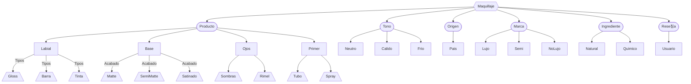

# Base de datos
Esta evidencia se creo un diagrama entidad-relaci칩n no estructurado sobre el **maquillaje**, enseguida presenento el diagrama construido:

```mermaid


  flowchart TD
    Maquillaje["Maquillaje"] --> Producto(["Producto"]) & Tono(["Tono"]) & Origen(["Origen"]) & Marca(["Marca"]) & Ingrediente(["Ingrediente"]) & Rese침a(["Rese침a"])
    Producto --> Labial["Labial"] & Base["Base"] & Ojos["Ojos"] & Primer["Primer"]
    Labial -- Tipos --> Gloss["Gloss"] & Barra["Barra"] & Tinta["Tinta"]
    Base -- Acabado --> Matte["Matte"] & SemiMatte["SemiMatte"] & Satinado["Satinado"]
    Ojos --> Sombras["Sombras"] & Rimel["Rimel"]
    Primer --> Tubo["Tubo"] & Spray["Spray"]
    Tono --> Neutro["Neutro"] & Calido["Calido"] & Frio["Frio"]
    Origen --> Pais["Pais"]
    Marca --> Lujo["Lujo"] & Semi["Semi"] & NoLujo["NoLujo"]
    Ingrediente --> Natural["Natural"] & Quimico["Quimico"]
    Rese침a --> Usuario["Usuario"]
    Maquillaje@{ shape: hex}
    Gloss@{ shape: trap-b}
    Barra@{ shape: trap-b}
    Tinta@{ shape: trap-b}
    Matte@{ shape: trap-b}
    SemiMatte@{ shape: trap-b}
    Satinado@{ shape: trap-b}
    Sombras@{ shape: trap-b}
    Rimel@{ shape: trap-b}
    Tubo@{ shape: trap-b}
    Spray@{ shape: trap-b}
```
