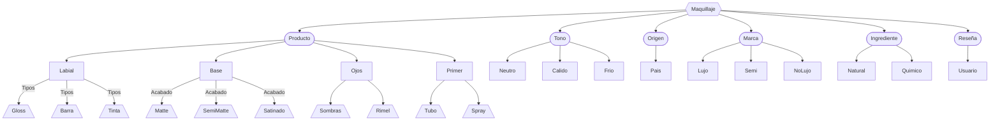

# Base de datos
Esta evidencia se creo un diagrama entidad-relación no estructurado sobre el **maquillaje**, donde;
- **Hexágono**: relación (MAQUILLAJE)
- **Estadios**: para las entidades
- **Rectángulos**: para los atributos
- **Trapezoides**: para los dominios de cada uno de los atributo

# Dominio de los atributos

| Dominio     | Atributo | Descripción                                   | Tipo de dato | Ejemplo de dominio                                             |
|-------------|----------|-----------------------------------------------|---------------|----------------------------------------------------------------|
| PRODUCTO    | LABIAL   | Tipo de labial                                | String        | {'Gloss', 'Barra', 'Tinta'}                                   |
|             | BASE     | Acabado de la base                            | String        | {'Matte', 'SemiMatte', 'Satinado'}                            |
|             | OJOS     | Producto para los ojos                        | String        | {'Sombras', 'Rimel'}                                          |
|             | PRIMER   | Tipo de presentación                          | String        | {'Tubo', 'Spray'}                                             |
| TONO        | NEUTRO   | Tipo de subtono                               | String        | {'Mute', 'Bright', 'Deep'}                                    |
|             | CÁLIDO   | Tipo de subtono                               | String        | {'Mute', 'Bright', 'Deep'}                                    |
|             | FRÍO     | Tipo de subtono                               | String        | {'Mute', 'Bright', 'Deep'}                                    |
| ORIGEN      | PAÍS     | País donde se creó                            | String        | {'Estados Unidos', 'México', 'Corea del Sur'}                |
| INGREDIENTE | NATURAL  | Tipo de ingrediente sin modificación          | String        | {'Leche de arroz', 'Centella Asiática', 'Aloe Vera'}         |
|             | QUÍMICO  | Tipo de ingrediente con modificación          | String        | {'Ceramida', 'Propaneidol', 'Panthenol'}                      |
| RESEÑA      | USUARIO  | Calificación que dio el usuario               | Float         | Valores positivos; 2.9, 4.5, 5                                |
