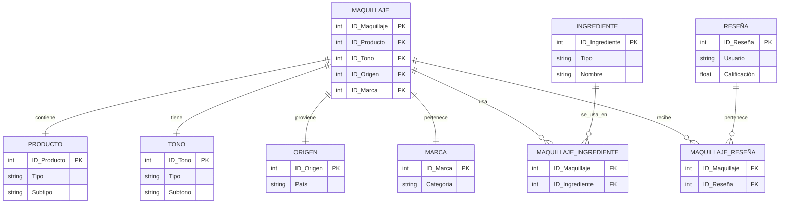

# Modelo relacional
## Modelo entidad-relación
Para el efecto de esta evidencia, se organizo los datos sobre el **maquillaje** en una base de datos relacional estructurada. 
Primero, para organizar los datos y explicar de mejor manera su relación, se armo el modelo entidad-relación representa visualmente: 
| Entidad     | Atributos clave (ejemplos)                                 |
| ----------- | ---------------------------------------------------------- |
| Producto    | ID\_Producto (PK), Tipo (Labial/Base/Ojos/Primer), Subtipo |
| Tono        | ID\_Tono (PK), Tipo (Neutro/Cálido/Frío), Subtono          |
| Origen      | ID\_Origen (PK), País                                      |
| Marca       | ID\_Marca (PK), Categoría (Lujo/Semi/NoLujo)               |
| Ingrediente | ID\_Ingrediente (PK), Tipo (Natural/Químico), Nombre       |
| Reseña      | ID\_Reseña (PK), Usuario, Calificación                     |
- El **maquillaje** tiene un _producto_, un _tono_, un _origen_, una _marca_, al menos un _ingrediente_, y puede tener varias _reseñas_.

## Álgebra Relacional: Operaciones
A continuación se presentan cuatro operaciones útiles para consultar la base de datos:

- **Operación 1**: Obtener todos los productos tipo "Labial" de subtipo "Tinta".

    π_ID_Producto (σ_Tipo='Labial' ∧ Subtipo='Tinta' (PRODUCTO))

    _Explicación_: Se proyectan solo los ID de productos que son labiales y específicamente del subtipo "Tinta".

- **Operación 2**: Mostrar todos los maquillajes hechos con ingredientes naturales

    π_ID_Maquillaje (
    (σ_Tipo='Natural'(INGREDIENTE)) ⨝ MAQUILLAJE_INGREDIENTE
    )

    _Explicación_: Seleccionamos los ingredientes naturales, los unimos con la tabla que relaciona maquillajes e ingredientes, y proyectamos los IDs de maquillajes que los usan.

- **Operación 3**: Obtener reseñas con calificación mayor a 4.0

    σ_Calificación > 4.0 (RESEÑA)

    _Explicación_: Se filtran solo aquellas reseñas cuya calificación es superior a 4.0.

- **Operación 4**: Obtener maquillajes fabricados en Corea del Sur con tono "Frío"

    π_ID_Maquillaje (
    (σ_País='Corea del Sur'(ORIGEN)) ⨝ MAQUILLAJE ⨝ (σ_Tipo='Frío'(TONO))
    )

    _Explicación_: Se seleccionan maquillajes cuyo país de origen es Corea del Sur y tienen tono frío, proyectando solo sus identificadores.
